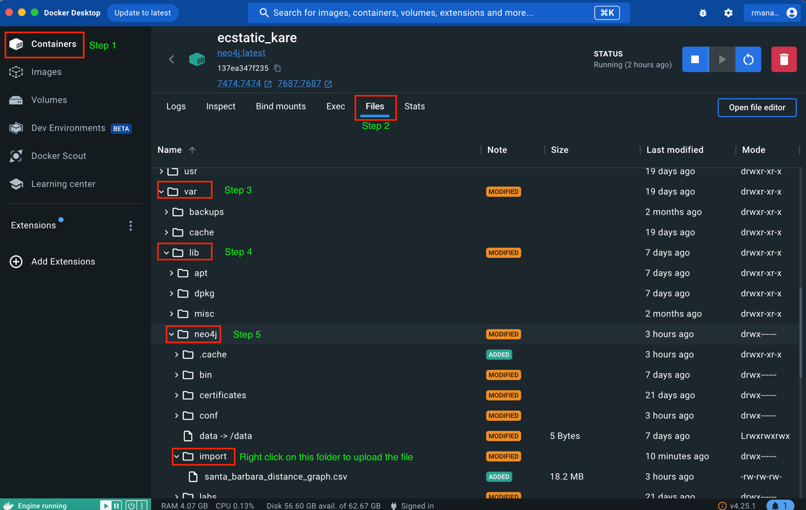

# dsc202_course_project 

## Setup Instructions:

### neo4j:
Installation steps based on: https://www.youtube.com/watch?v=IShRYPsmiR8&ab_channel=ChrisHay

- docker pull neo4j
- docker images
- docker run -p7474:7474 -p7687:7687 -d --env NEO4J_AUTH={CREATE YOUR USERNAME}/{CREATE YOUR PASSWORD} neo4j:latest
- docker ps
- Go to http://localhost:7474 

You have successfully installed neo4j!!

Next we upload the data onto neo4j.

Open up your docker desktop app and follow the steps shown in the image below

Next you can upload the data onto neo4j as a graph by executing the following command. 

LOAD CSV WITH HEADERS FROM 'file:/santa_barbara_distance_graph.csv' as row  
MERGE (r1:Restaurant {id: row.restaurant_from}) 
MERGE (r2:Restaurant {id: row.restaurant_to}) 
MERGE (r1)-[:distance{dist: toFloat(row.distance)}]->(r2) 
MERGE (r2)-[:distance{dist: toFloat(row.distance)}]->(r1) 

 

LOAD CSV WITH HEADERS FROM 'file:/santa_barbara_restaurant_categories.csv' as row  
MERGE (r:Restaurant {id: row.business_id})  
MERGE (c:Category {id: row.category})  
MERGE (r)-[:rating{value: toFloat(row.weighted_rating)}]->(c)  

